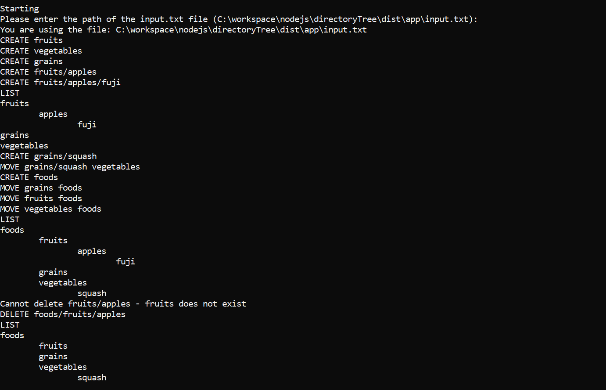
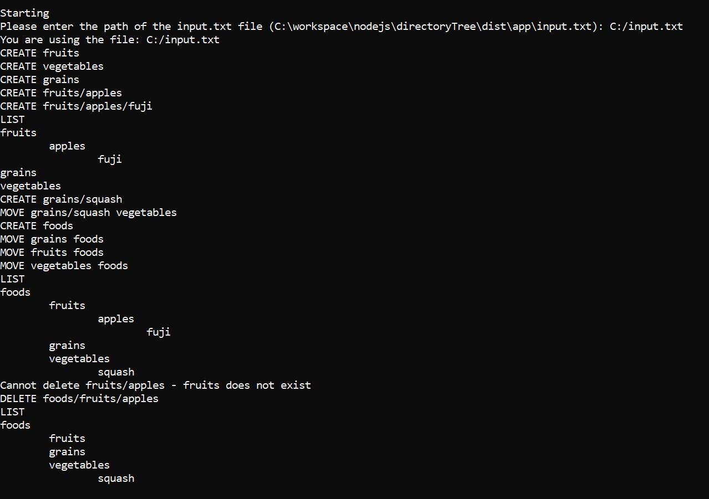

## Instructions:

- Install:

  - npm install

- Compile

  - npm run-script build

    Warning: Every build process delete the 'dist' folder

- Use (expect the output on the node console):

  - npm start
  - Or execute 'node ./dist/app/main.js'

    The NodeJS CLI will ask you for the path of the 'input.txt' file, or you can leave empty to use a default input.txt file located in the same folder of the compiled script

    Default Path Example:
    

    Custom Path Example:
    

- Test:

  - npm test

- Pack:

  - npm pack

## Tech Stack:

- Test: Mocha, Tai
- NodeJS & Typescript

### Improvements for the future

- Add more unit tests
- Verify refactors in the logic layers
